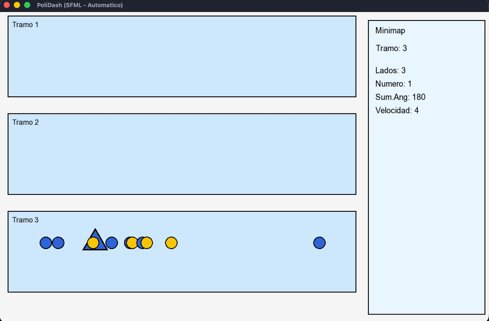

# PoliDash Runner (SFML 3 compatible)

Compatible con **SFML 3.x** (Homebrew) y **SFML 2.5**. Usa CMake para VSC y CLion.

## Compilar
En la carpeta raiz del proyecto (POLIDASH_RUNNER...)
```bash
mkdir build && cd build
cmake -DCMAKE_PREFIX_PATH="$(brew --prefix sfml)" ..
cmake --build . --config Release
./polidash_sfml
```

Dentro de la carpeta Build:
mkdir -p assets
cp /System/Library/Fonts/Supplemental/Arial.ttf assets/DejaVuSans.ttf
# Nota: el ejecutable busca ./assets/DejaVuSans.ttf relativo a donde lo ejecutas (build)

Luego ./polidash_sfml para observar los textos
> Para que se vean textos, coloca un `.ttf` en `assets/DejaVuSans.ttf` o `arial.ttf` junto al ejecutable.




